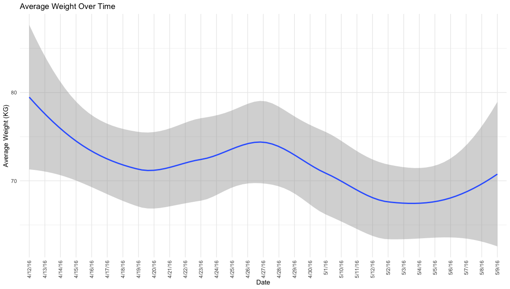

# [Click here to Bellabeat Smart Device Data Analysis](https://ken52093.github.io/Bellabeat_User_Behavior_Analysis/)

## Description

This is a data analysis project focused on analyzing smart device fitness data from Bellabeat to gain insights into user behavior and trends. The goal is to identify potential growth opportunities for Bellabeat and guide their marketing strategy.

## Data Sources

The data used in this analysis was obtained from multiple CSV files provided by Bellabeat. The following datasets were used:
- `dailyActivity_merged.csv`: Daily activity data of users, including steps, distance, active minutes, and calories burned.
- `sleepDay_merged.csv`: Sleep data of users, including total sleep records, total minutes asleep, and total time in bed.
- `weightLogInfo_merged.csv`: Weight log data of users, including weight measurements over time.

## Analysis

The analysis includes the following key insights:

1. **Activity Level Patterns:** Histograms demonstrate that most users prefer spending time on lightly active and sedentary exercises.

2. **Manual Logging Behavior:** The analysis also showed that users are actively engaged in logging their activities. This level of engagement is a positive sign, indicating that users are finding value in tracking their fitness activities using our platform.

3. **Weight Loss Over Time:** An encouraging trend observed is that the average weight of the users has decreased over time. This indicates the potential effectiveness of the app/device in assisting users to lose weight, which is a common health goal. This trend can be highlighted in the marketing efforts to attract new users.

4. **Average Sleep Duration Over Time:** The analysis reveals fluctuations in sleep duration over the study period, with no clear trend observed. This could be attributed to external factors affecting sleep patterns or users adjusting to the sleep tracking feature of our app or device. Investing in understanding these variations could lead to better insights and allow us to provide enhanced tips and features that help users improve sleep consistency.

## Conclusion

The analysis highlights several important trends and insights that can guide Bellabeat's marketing strategy. Users seem to prefer lightly active and sedentary exercises, indicating an opportunity to focus on providing features that cater to these preferences. Additionally, the data suggests that users' sleep duration and weight can be positively impacted by using the app or device.

In terms of attracting new users and retaining existing ones, our data suggests the following strategies:

1. Create beginner-friendly content and features.
2. Enhance manual input features for better user engagement.
3. Highlight the potential benefits to sleep patterns and weight loss in marketing materials.

## Future Work

For future improvements, Bellabeat could consider conducting more in-depth analyses to understand the factors influencing sleep duration fluctuations and user engagement with the app. Furthermore, the company could explore personalized features based on user preferences and health goals.

## Contact

For any inquiries or collaborations, please feel free to reach out to [Ken](mailto:wave0918362269@gmail.com).
